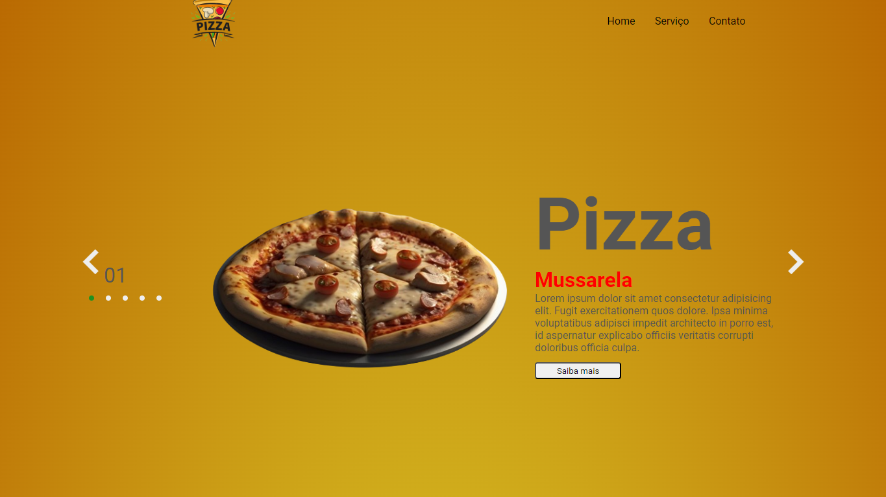

<h1 align="center">Pizzaria</h1>

<h2>Olá sejam bem-vindo</h2>

Projeto Delicioso: Site de Pizzaria com Carrossel de Sabores

Acabei de finalizar um projeto empolgante: um site para pizzaria com um carrossel de sabores incrível!

<h4>O que o site oferece:</h4>
<ul>
<li>Um menu interativo com cinco sabores deliciosos de pizza, cada um com foto e descrição.</li>
<li>Um carrossel responsivo que facilita a navegação e deixa o site ainda mais atraente.</li>
<li>Design clean e moderno, com cores vibrantes que despertam o apetite.</li>
</ul>

Desenvolvido com HTML, CSS e Javascript, garantindo um site leve, rápido e compatível com diversos dispositivos.

Tenho orgulho do resultado final e estou ansioso para compartilhar esse projeto com vocês!

<h4>Link:</h4>

> Portfólio: https://daliosy.github.io/PORTFOLIO

> Deploy: https://daliosy.github.io/pizzaria

> Linkedin: https://www.linkedin.com/in/dalio-s-yamada/

#sitedepizzaria #carrossel #HTML #CSS #Javascript #desenvolvedorweb #design

 

  <ul align="center">
    <h2 style="display: inline-block">Imagens:</h2>
  </ul>

 
  
  
  
  
  
 

